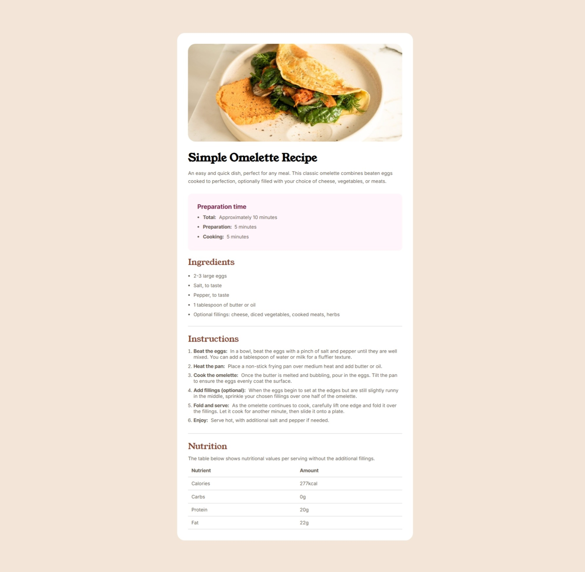

# Frontend Mentor - Recipe page solution

This is a solution to the [Recipe page challenge on Frontend Mentor](https://www.frontendmentor.io/challenges/recipe-page-KiTsR8QQKm). Frontend Mentor challenges help you improve your coding skills by building realistic projects.

## Table of contents

- [Overview](#overview)
  - [The challenge](#the-challenge)
  - [Screenshot](#screenshot)
  - [Links](#links)
- [My process](#my-process)
  - [Built with](#built-with)
  - [What I learned](#what-i-learned)
  - [Continued development](#continued-development)
- [Author](#author)
- [Acknowledgments](#acknowledgments)

## Overview

### Screenshot

### Links

- Solution URL: [https://github.com/uptowngirl757/recipe_page-frontend-mentor-](https://github.com/uptowngirl757/recipe_page-frontend-mentor-)
- Live Site URL: [https://uptowngirl757.github.io/recipe_page-frontend-mentor-/](https://uptowngirl757.github.io/recipe_page-frontend-mentor-/)

## My process

### Built with

- Semantic HTML5 markup
- CSS custom properties

### What I learned

I learnt how to use the `border-collapse` property.

### Continued development

I need to continue to discover other useful CSS properties that can help building more intresting layouts

## Author

- Frontend Mentor - [@uptowngirl757](https://www.frontendmentor.io/profile/uptowngirl757)

## Acknowledgments

A hat tip to Frontend Mentor's discord community. You guys saved me on this one. So, Thanks!
